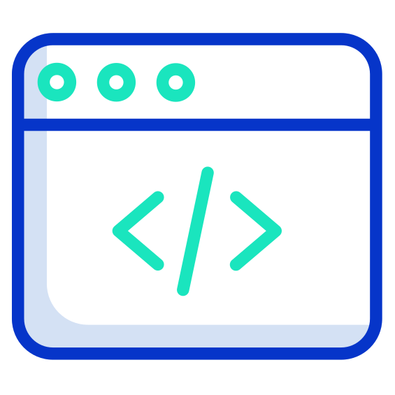

    

# Front end starter

This is a simple front end development (HTML, CSS, JS) starter template
with support for TypeScript, Babel, Webpack, Jest, GitHub Pages deployment.

## Usage

- build & serve the app in development mode `npm start`
- run optimized build for production `npm build`
- deploy the app to your gh-pages branch `npm run deploy`

## Resources

- [TypeScript Deep Dive book](https://basarat.gitbook.io/typescript/)
- [Building and publishing an NPM TypeScript package](https://itnext.io/step-by-step-building-and-publishing-an-npm-typescript-package-44fe7164964c)
